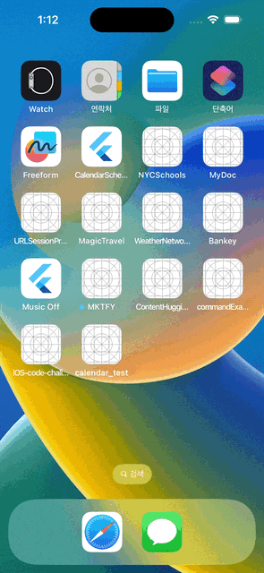
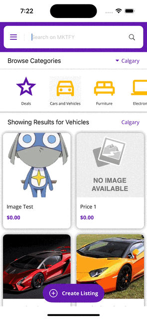
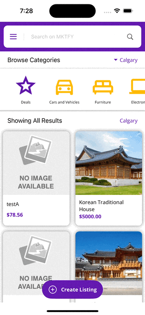
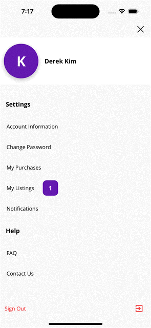
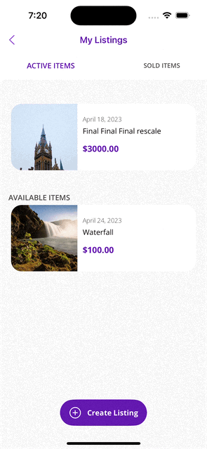
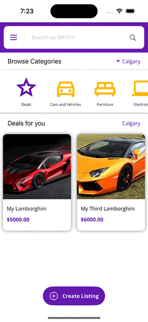

# 

A buy & sell platform for users to list, view, purchase, and sell items. 

- Developed the entire app using Swift/UIKit, incorporating storyboards, navigation control, and MVC & MVVM design patterns.
- Collaborated with UX/UI designer to ensure adherence to design guidelines and app flow.
- Employed Agile methodology, utilizing Jira for project management and bi-weekly sprints.
- Setup user interfaces and managed data using API calls for GET, POST, and PUT requests


## 🚀 About Me
I'm a iOS/Flutter Developer...

👋 Hi, I’m Noobietubie!  
👀 I’m interested in Mobile App Development.  
🌱 I’m currently learning Flutter/Dart/Swift(UIKit)/SwiftUI.  
💞️ I’m looking to collaborate on pretty much anything that will help me gain knowledge!  
📫 How to reach me dk@derek.kim
## Authors

- [@treasure3210](https://www.github.com/treasure3210)

## API Reference

### AUTH
#### Change password via Auth0
```http
  POST /api/Auth/changepassword
```

### FAQ
#### Get All FAQs
```http
  GET /api/FAQ
```

#### Get a specific FAQ by Id
```http
  GET /api/FAQ/{id}
```

### Product
#### Create a new listing
```http
  POSt /api/product
```

#### Get all listings
```http
  GET /api/product
```

#### Update a listing
```http
  PUT /api/product
```

#### Perform a search
```http
  POST /api/product/search
```

#### Retrieve listings in a category
```http
  POST /api/product/category
```

#### Get a specific listings by Id
```http
  GET /api/product/{id}
```

#### Purchase a listing
```http
  PUT /api/product/checkout/{id}
```

#### Complete the purchase of a listing
```http
  PUT /api/product/complete/{id}
```

#### Cancel the sale of a listing and make it available again
```http
  PUT /api/product/cancelsale/{id}
```

#### Cancel a listing and remove it from sale
```http
  PUT /api/product/cancel/{id}
```

### Upload
#### Upload 1 or more files (image(s))
```http
  POST /api/upload
```

### User
#### Create a new user
```http
  POST /api/user/register
```

#### Get all of user's purchases
```http
  GET /api/user/purchases
```

#### Get all of a user's listings (active, pending, and cancelled)
```http
  GET /api/user/products
```

#### Get count of a user's notifications (unread)
```http
  GET /api/user/notifications/count
```

#### Get a user's notifications
```http
  GET /api/user/notifications
```

#### Get a user profile
```http
  GET /api/user/{id}
```

#### Update a user profile
```http
  PUT /api/user
```

## 💻 Demo
### Splash Screen 


### Login Flow
#### Login | Sign Up | Forgot Password
  

### Dashboard
#### Dashboard | Search & Purchase | Search & Show Deals | Create Listing | Filter by Cities
    

### Menu
#### Account Information


#### Change Password
 

#### My Purchases


#### My Listing
  

#### Notification


#### FAQ


#### Contact Us


#### Sign Out


## Badges
[](https://choosealicense.com/licenses/mit/)

## Feedback
If you have any feedback, please reach out to us at treasure3210@gmail.com

